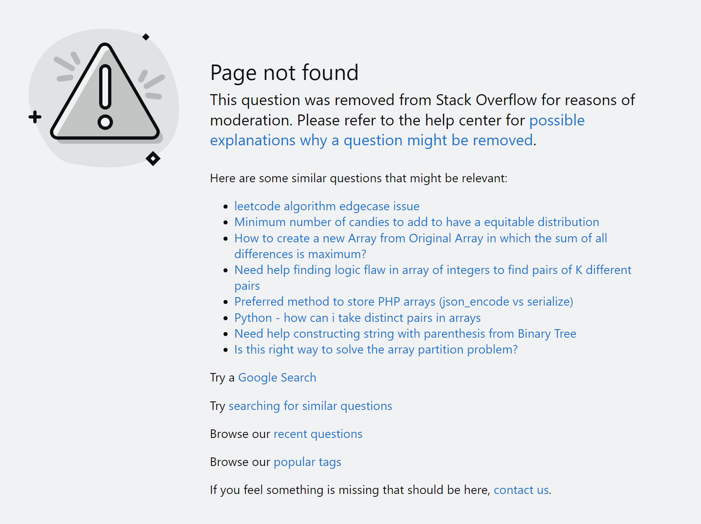
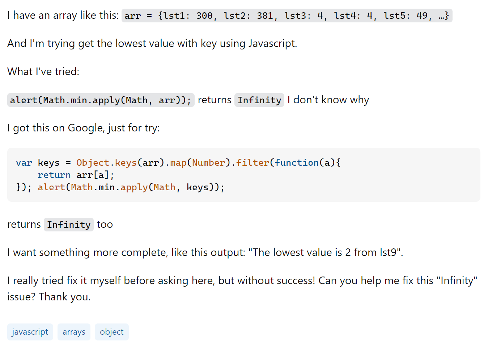

<meta name="viewport" content="width=device-width, initial-scale=1">
<link href="https://cdn.jsdelivr.net/npm/bootstrap@5.2.0/dist/css/bootstrap.min.css" rel="stylesheet">

<body>

<h1>"The only stupid question is the one you didn't ask."</h1>

This is a phrase I have heard many professors say to make students feel less embarrassed to ask questions in class, especially in front of their peers. And yes, it's better to ask a question than not to, and in my college experience so far, I have had the fortune of hearing almost exclusively "smart" questions. In Computer Science, those are generally questions that provide relevant context of the problem, symptoms of the problem, and why that problem is stopping the asker from getting to their goal, among other things. 

That being said, the Internet is full of quite the opposite: instant-gratification-expectant not-so-smart questions.

<h1>Downvote, downvote, downvote</h1>

Approximately 9 hours ago as of writing, Karim Gaber on <a href="https://stackoverflow.com">Stack Overflow</a> proposed that we have a candy store, and a box of 2*n candies. Flavors are represented by a numeric value and, given an array of different flavors, we must arrange the flavors into matching pairs, e.g. [5, 8, 5, 8, 8, 8] should be divided into three pairs, (5, 5), (8, 8), and (8, 8). Then, the program returns how many pairs there are. 

How should this program be written?

Sorry, Karim. Nobody's gonna do your homework for you. That sentiment has been well-illustrated by the barren reply section.

UPDATE: As of December 14, 2023, Karim has done the delete-post of shame as you can see by following the <a href="https://stackoverflow.com/questions/77061160/candy-store-problem-solving-coding-challenge">original question's link.</a> Hopefully, over the past 4 months, he's learned to ask better questions based off of the critique I've offered!

<h2>How could the question have been improved?</h2>

To be frank, Karim's original post is a mess that looks like it was copy-pasted off of his course's webpage, with no attempt to fix the messed up formatting at all. There was no effort put into readability. Honestly, I had to guess as to what the problem was asking because of how illegible it was, so that would be thing #1 to improve. If no one can understand what you're trying to ask, don't expect an answer!

Assuming he has already attempted the homework, Karim should have mentioned what specific problem he is having with his code. He should include the relevant problem code (not his whole program) and explained the specific issues he was having with it so that other Stack Overflow users can more easily diagnose his problem. Additionally, he should have clearly stated what he has already searched online/tried.

Additionally, since it's not very clear, it might help to clarify <em>why</em> Karim included all of the tags that he did: arrays, turing-machine, hashmaps. To me it seems that the program could be accomplished with only arrays—we could iterate through the initial array, run some sort of comparison that keeps track of matching numbers, and then return a counter which kept track of the amount of pairs that were created. It makes tags like "hashmaps" and "turing-machine" seem like they're supposed to be used in the answer, but we can't know for sure because Karim copy-pasted his question without any further instructions or attempts at the question for people to <em>try</em> to correct.

Unfortunately, this question has pretty much no redeeming qualities, and by the fact that Karim deleted his question, it was unlikely that it got answered. It's possible it might have even gotten negative votes.

Remember—you're asking for help! It's no one's job or obligation to answer questions that, theoretically, you should be able to figure out the answer to on your own. People who answer questions are doing it out of the kindness of their hearts, so the least you could do is ask a <em>smart question</em>. So then, what makes a smart question?

<h1>Upvote, upvote, upvote!</h1>

On a post from 4 years ago, <a href="https://stackoverflow.com/questions/55332453/get-key-with-minimum-value"> Mernt presented with an object with five key-value pairs, in which the values were integers of varying value.</a> He wanted to be able to return the key-value pair with the smallest numerical value. He included code for his personal attempt 
<code>alert(Math.min.apply(Math, arr));</code>
which returned <code>Infinity</code>, and a Googled solution,

<pre>
<code>var keys = Object.keys(arr).map(Number).filter(function(a){
    return arr[a];
}); alert(Math.min.apply(Math, keys));</code>
</pre>

which also returned <code>Infinity</code>. The goal was to print to the console something along the lines of, "The lowest value is _x value_ from _y key_."

What can be done to fix the "Infinity" issue?

It's no surprise that this post received 10 answers with a variety of potential solutions.

<h2>What made this question successful?</h2>

Everything in this question was straight to the point. Mernt clearly stated the issue, the goal, and what he had already tried with the results. The title of the post was specific and quaintly described the issue, "Get key with minimum value," and the question was specific and based on a limited amount of code—not a whole program. Appropriate tags were used, each of which gave context to the situation: this is in javascript, the program has to do with iterating through an array, and uses functions of the Object class. To top it off, Mernt was polite, ending the post with "Thank you."

The replies reflected the clarity of the question: they were straight to the point and offered several potential solutions to the "Infinity" problem. One user suggested he use <code>Object.entries()</code> to help sort the entries by value in ascending order, another suggested iterating through the object, among other unique suggestions.

This smart question helped Mernt create successful code.

<h1>Success begins with asking smart questions</h1>

For Software Engineers, asking smart questions is extremely critical to your success. It may prove to be the difference between actually diagnosing your problem or being stuck with buggy code that you don't have solutions for. At worst, it is impossible to solve a problem without a good understanding of the context surrounding it. At best, difficult/tedious without knowing the previous attempts at solving it (including previous web searches). For the sake of both yourself and those who are trying to help you, it is in your best to include as much <em>relevant</em> detail as possible.

However, questions don't just require a large amount of details to be considered "smart." In fact, including excess information (e.g. including your whole program when there's a bug in one method) may be detrimental—not all kind Internet strangers want to read <em>all that</em>. Precision matters, not only to attract helpful answers, but so that you <em>yourself</em> have an understanding of what the problem is in the first place.

<h2>Reflecting on my smart questions</h2>

Personally, I have always tried to write "smart" questions, especially on the Internet in order to avoid the down votes, though most of my experience is from asking questions on <a href="https://www.reddit.com/r/calculus/">Reddit's r/calculus</a>. Luckily, asking smart questions about math translates pretty well to asking smart questions about code. Writing this has forced me to reflect on my old questions on <a href="https://www.reddit.com/r/javahelp/">r/javahelp</a> and determine what areas I need to work on. Since I am a lot less "literate" in code, I think my biggest struggle is cutting down my code to the most relevant portions since I have trouble deciding which lines are pertinent to my issue. Another area I could work on is describing the symptoms of the issue rather than proposing the "educated guesses" I came up with and cluttering the post with solutions I've tried (and by solutions, I don't mean steps to diagnose—I mean long, convoluted, broken "solutions").

In the future, I will definitely be asking myself if that extra detail is important to finding a solution or just clutter. I hope to continue improving my questions to make them smarter, but I hope that I will be met with mercy on the inevitable, odd stupid ones, too.

</body>