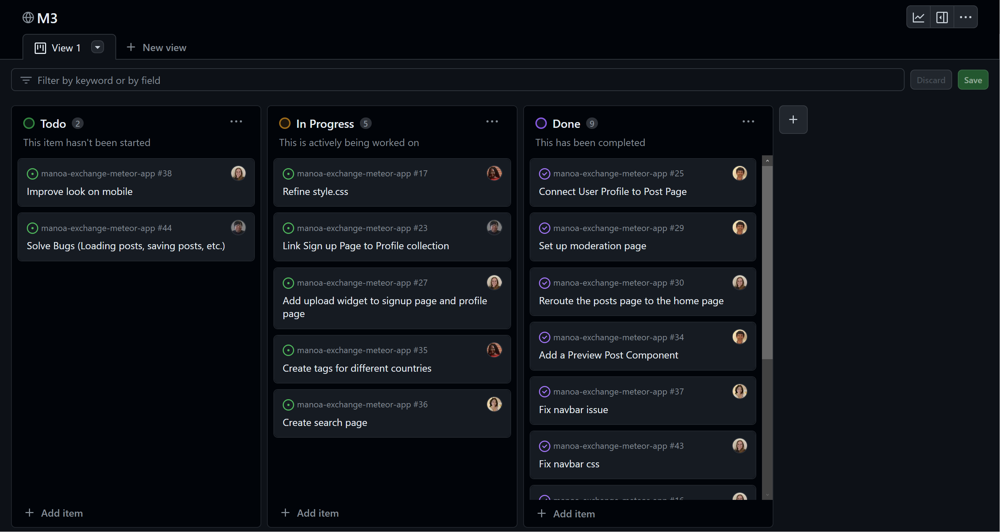

<meta name="viewport" content="width=device-width, initial-scale=1">
<link href="https://cdn.jsdelivr.net/npm/bootstrap@5.2.0/dist/css/bootstrap.min.css" rel="stylesheet">

<body>

<h1>A world of engineering</h1>

For a very long time, I have wanted to follow in my father's footsteps and become a Mechanical Engineer. I have always gravitated towards science and math, and even in my passion for art, the projects I did often followed the engineering design process. Although I have been insecure about my ability to be a "good engineer," I believe that my passion for engineering in all of its forms will make me the engineer that I want to be. This will be my last semester as a Computer Science major, but I am grateful for all of the experiences and knowledge I have gained from this temporary path.

ICS 314, Software Engineering I, has been my favorite class this semester, not necessarily because of the material we learned, but because of the engineering principles that it incorporated that felt so familiar and nostalgic to me. 

<h2>Functional Programming</h2>

One such principle was immutability and modularity. <em>Functional programming</em> is essentially that, but for software development. The idea is to focus on breaking the problem into smaller pieces that do a simple, specific job, then put it all together into a larger program. In other words, the idea is to write smaller functions that can be put together to do a bigger job.

Luckily, in ICS 314, we were able to use a library of pre-made functions called <a href="https://underscorejs.org">Underscore.js</a> to do our assignments. Some of our assignments actually centered around the use of this to emphasize that we can <em>and should</em> take advantage of the tools that we are given!

Functional programming allows us to reduce the amount of effort we need to put into any given program by largely avoiding assignment statements, loops, and other logical tedium. It's comparable to buying a motor for a mechanical project rather than building your own motor from scratch. Technically, you could build your own motor, say you have all of the pieces and knowledge required, but it's easier and much more time efficient to simply use something that's already been made.

Regular code:

<pre class="code-bg">
<code>findMenuItem(ingredient) {
  let returnItem = [];
    for (let i = 0; i < this.menuItem.length; i++) {
      if (this.menuItem[i].ingredients.includes(ingredient)) {
      	returnItem.push(this.menuItem[i]);
      }
    }
  return returnItem;
}</code>
</pre>

With functional programming:

<pre>
<code>findMenuItem(ingredient) {
  return _.filter(this.menuItem, item => _.contains(item.ingredients, ingredient));
}</code></pre>

Although there may not be anything exactly equivalent to functional programming outside of the scope of Computer Science, I would like to draw a comparison between Software and Mechanical Engineering in that they both are working with components to create a larger product. Whether that product be a social networking site or fuels infrastructure, it all comes down to components and thinking in these components.

My favorite way to explain this similarity is through explaining how a hand mixer works: a power source is connected to a motor which rotates, then the motor which is connected to a corkscrew turns two sets of gears which then turn the mixers, all housed within a ergonomic body. It's a gross simplification, but at the end of the day, the idea is to work in simple components to create something greater.

<h2>Agile Project Management</h2>

In high school, I was president of the Rocketry Club, meaning that—besides my duties as a club officer—I was put in charge of running most meetings and managing the competition team. I gained a lot of wisdom on running a team from the president before me, and did my best to continue the practices he introduced. These things included keeping a Scrum board, doing a brief check in every meeting (which were three times a week), and scheduling dates to meet major goals by. Little did I know that this was <em>agile project management</em>.

Agile project management is a style of project management that focuses on making incremental, responsive progress. The process is done iteratively, rolling out small change after small change until the final product is done. This style of project management is flexible and can adapt to address issues that pop up as they occur.

In ICS 314, we practiced a more software development-centric form of agile project management called <em>issue driven</em> project management. Essentially, each task was called an "issue," and each issue was associated with one assignee and one branch off of the main branch in the repo (i.e. an isolated version of the software that could be freely modified to safely accomplish the task). Each task should theoretically take 3 days to accomplish. This was all organized in what was called a "Milestone," which was actually a <a href="https://github.com">GitHub</a> project. It looks pretty strikingly similar to a Scrum board...

What was great about the way it was implemented in the course was that we could always see what our teammates were doing. It was an invaluable tool in keeping the project on track with such strict deadlines.

I can definitely see myself using agile project management in the future, regardless of the field I end of working in. As long as I am working in a group, I believe that agile project management is <em>the</em> tool to get things done. Not only is it all I know project management wise, but it is extremely effective in making it obvious who is lagging behind, who is ahead of schedule, who is assigned to what, what is <em>my</em> next task, etc. Whether it's designing and building a rocket or coding up a whole web app, agile project management is the way to go.

<h1>Moving forward</h1>

 As I bid farewell to the this chapter of my academic journey, I do so with gratitude for the challenge and wisdom. This transition marks not an endpoint, but an evolution into more engineering—just the type I am passionate about. I eagerly anticipate applying these skills to physical systems and hope to use everything I have learned as a Computer Science student to contribute meaningfully to the world of Mechanical Engineering. Although I won't be working on anymore software anytime soon, the skills and lessons I learned from ICS 314 have been invaluable.

</body>