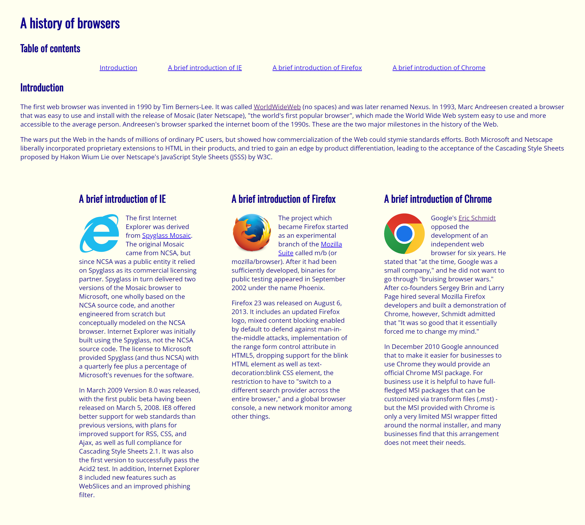

<meta name="viewport" content="width=device-width, initial-scale=1">
<link href="https://cdn.jsdelivr.net/npm/bootstrap@5.2.0/dist/css/bootstrap.min.css" rel="stylesheet">

<body>

When I did the "Browser History" homework WODs, I was underwhelmed by the result. It was a lot of work for a <em>really</em> ugly product.

Maybe it's the color combination and the blue hyperlinks, but it looks like an early 2000's website. It looks like it's trying to steal my personal information. It looks like my browser is going to <em>strongly</em> advise me to leave this site. It scares
me. But what scares me more is <em>how much work</em> I put into it for it to come out looking like <em>that</em>. How was I ever going to make a beautiful UI if I was struggling to make an ugly one?

    

## What makes UI Frameworks so useful?

In ICS 314, the UI Framework we used is Bootstrap. Bootstrap has a grid system that allows us to create responsive rows and columns. For my purposes, it has been an absolute game changer, turning what would have been a 20 minute fight with CSS to
create columns into a trivial task. It has allowed me to create clean, modern-looking UIs, such as this recreation of the <a href="https://independentenergyhawaii.com">Independent Energy</a> about page.

    

It's not just the grid system---it's the buttons, the navigation bar, the background images and the embedded video, too. Because Bootstrap is a collection of CSS classes, it makes building a visually appealing UI so much easier.

For this website recreation assignment, I custom made the buttons, though I really didn't have to. I just wanted the button to look accurate to the actual website, though Bootstrap's <code>btn-outline-light</code> class would have made a really nice, similar looking button. No ugly, early 2000's raw HTML and CSS buttons to be found!

Though these pre-made classes for stylized elements are great, I have to emphasize that the best thing about Bootstrap is undoubtedly the grid system. It's not that hard to learn, and learning it quickly pays off. I don't think I can ever go back to raw HTML and CSS knowing that I won't have Bootstrap's intuitive grid system in my toolbelt.

## Bootstrap makes life good

So good, in fact, that I used it to help me format this essay! Before writing this essay, I knew I wanted to include images that would relate to the text beside it. Especially since the images are taller than they are wide, I knew it would be a clunky read, so I immediately added Bootstrap's script tags and started arranging things to my liking. 

And after all that, I can confidently say this is probably my most visually interesting essay, yet I didn't break a sweat thanks to Bootstrap!

</body>