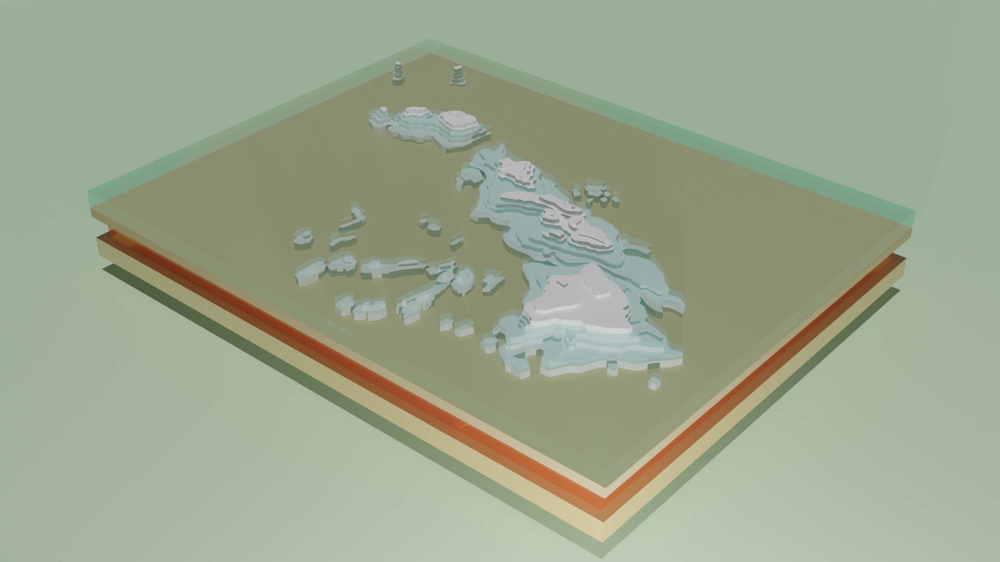
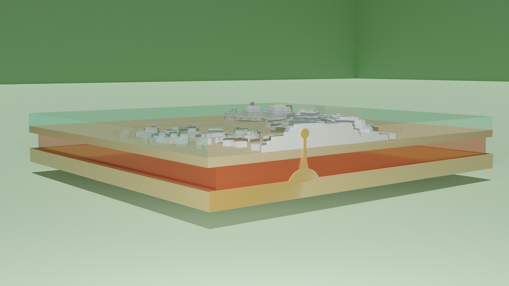

 

In my Marine Biology class in the Spring 2023 semester, I was tasked to create a model of Hawaii and the hotspot that formed the islands. The model needed to include the ocean, the crust, the mantle, and the outer core, as well as the main Hawaiian islands and the surrounding seamounts. I decided to work in Blender because of the quality of renders that can be achieved with the built in Cycles rendering engine. 

Because I had to show the seamounts and the ocean, I adjusted the transmission setting of the Principled BSDF shader to create a clear texture for the water. I also bisected my model to create the hot spot diagram underneath the Big Island. To make the height of the map as accurate as possible, I referenced topographical maps, and for assignment requirements, I created two geographically inaccurate atolls with appropriate relative heights in comparison to the main islands. 

This project challenged my 3D modeling abilities all around---topology, material shading, and rendering. I also have never needed to bisect a model before, so that was an interesting learning experience, which forced me to retpologize my model in order for the bisection and additional hot spot diagram to look neat.
