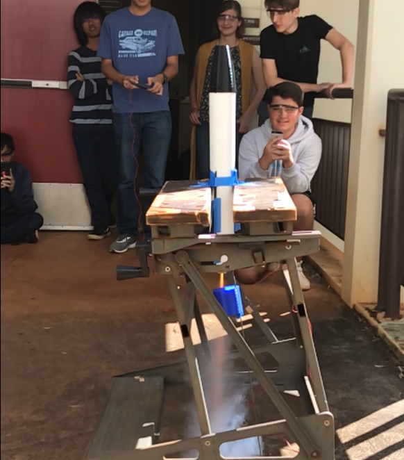

<meta name="viewport" content="width=device-width, initial-scale=1">
<link href="https://cdn.jsdelivr.net/npm/bootstrap@5.2.0/dist/css/bootstrap.min.css" rel="stylesheet">

In Spring 2019, I participated in Mililani High School's Rocketry club where we worked on a rocket for The American Rocketry Challenge (TARC). We were tasked to design a rocket of certain specifications that would reach apogee within a specific range, complete its flight within a certain time, while holding and protecting the payload---an approximately 50-gram egg.

I was tasked to use AutoCAD and Inventor to design the rocket's nose cone, fins, and air brakes which we would later 3D print. I took measurements of the required body tube to create a good-fitting nose cone that was loose enough to pop off at apogee. For everything else, I was given measurements and general directions by the research team on how they wanted the air brakes and fins to come out. We did several static tests using these parts, the results of which I used to refine the designs for a dynamic test.

Ultimately, we were unable to qualify as we were unable to get an NAR flight observer to come to Oahu to observe our rocket's qualification flight.

Overall, it was a good experience for designing an amateur rocket with custom parts, and I was able to develop proficiency in Inventor and AutoCAD. It was also my first time working in a team for an extended period of time. I learned a lot about leadership and project management, and since I served as secretary that year, I was in charge of updating the Scrum board and writing short reports on what everyone accomplished each meeting.

Because of the qualities that I developed over that year, the next school year I was voted in as president of the club. We signed up for TARC again in 2020, but were unable to complete the rocket due to the COVID-19 lockdowns.

